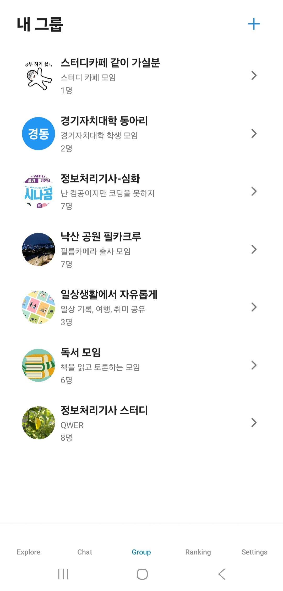

# Mirae - Group-Study Support App 

React Native (Expo) 기반의 그룹스터디 지원 모바일 애플리케이션입니다.

##  프로젝트 소개

Mirae(이하 미래)는 사용자들이 다양한 주제의 그룹을 만들고, 검색하고, 참여할 수 있는 소셜 그룹 지원 앱입니다.

### 주요 기능

- 🔐 **사용자 인증** - Firebase를 이용한 회원가입/로그인/로그아웃
- 🧭 **그룹 탐색** - 이달의 그룹, 인기있는 그룹 목록 조회
- 👤 **프로필 관리** - 사용자 프로필, 팔로워/팔로잉, 자기소개 편집
- 🔍 **그룹 검색** - 카테고리별 그룹 검색
- ➕ **그룹 생성** - 새로운 그룹 만들기
- 💬 **채팅** - 그룹 원과 또는 친구와 실시간 채팅
- 🏆 **랭킹** - 개인 및 그룹 별 포인트 합산하여 순위 측정

##  시작하기

### 🛠️ Tech Stack & Requirements

<div align="left">
  
  
  
</div>

<br>

### 📱 Prerequisites

| Platform | Requirement |
| :--- | :--- |
| **Common** | `Node.js 18+`, `npm` or `yarn` |
| **iOS** | iOS 15.1+ (Simulator or Physical Device) |
| **Android** | Android 7.0+ (API 24+, Nougat) |

### 설치 및 실행

1. **의존성 설치**

   ```bash
   npm install
   ```

2. **개발 서버 시작**

   ```bash
   npx expo start
   ```

3. **앱 실행**
   - iOS: `i` 키를 눌러 iOS 시뮬레이터에서 실행(Mac)
   - Android: `a` 키를 눌러 Android 에뮬레이터에서 실행(ex. Android Studio)
   - 웹: `w` 키를 눌러 웹 브라우저에서 실행

##  프로젝트 구조

```
Mirae
├── .gitignore                      
├── .prettierrc                     # 코드 스타일 자동 정리(Format) 설정 파일
├── .vscode                                     
├── README.md                       # 프로젝트에 대한 설명
├── app.json                        # Expo 앱의 이름, 버전, 아이콘 등 전체 설정 파일
├── app                             # 앱의 화면과 라우팅을 담당하는 폴더
│   ├── (tabs)                      # 하단 탭 네비게이션에 포함되는 화면들
│   │   ├── _layout.tsx             # 탭 네비게이션의 구조와 아이콘 설정
│   │   ├── chat.tsx                # 채팅 목록 화면
│   │   ├── explore.tsx             # 탐색 탭 화면
│   │   ├── group.tsx               # 내 그룹 목록 탭 화면
│   │   ├── index.tsx               # 앱의 메인(홈) 화면
│   │   ├── profile.tsx             # 내 프로필 탭 화면
│   │   ├── ranking.tsx             # 랭킹 확인 화면
│   │   ├── study-cert.tsx          # 공부 인증 화면
│   │   └── study-feed.tsx          # 공부 피드 화면
│   ├── chat
│   │   └── [id].tsx                # 개별 채팅방 상세 화면
│   ├── rooms
│   │   └── [roomid].tsx            # 스터디룸/방 상세 화면
│   ├── _layout.tsx                 # 앱 전체의 레이아웃
│   ├── create-group.tsx            # 그룹 생성 화면
│   ├── customer-center.tsx         # 고객 센터 화면
│   ├── delete-account.tsx          # 회원 탈퇴 화면
│   ├── followers-list.tsx          # 팔로워 목록 화면
│   ├── following-list.tsx          # 팔로잉 목록 화면
│   ├── group-application.tsx       # 스터디 지원서 작성 화면
│   ├── group-chat.tsx              # 그룹 채팅 화면
│   ├── group-detail.tsx            # 그룹 상세 정보 화면
│   ├── group-list.tsx              # 그룹 목록(검색 & 카테고리)
│   ├── group-settings.tsx          # 그룹 설정 화면
│   ├── join-complete.tsx           # 가입 완료 확인 화면
│   ├── language.tsx                # 언어 설정 화면
│   ├── modal.tsx                   # 공통 모달 화면
│   ├── notifications.tsx           # 알림 목록 화면
│   ├── privacy.tsx                 # 개인정보 처리방침 화면
│   ├── profile-management.tsx      # 프로필 수정 및 관리 화면
│   ├── select-grade.tsx            # 학년/등급 선택 화면
│   ├── sign-in.tsx                 # 로그인 화면
│   ├── sign-up.tsx                 # 회원가입 화면
│   └── user-profile.tsx            # 다른 유저의 프로필 조회 화면
├── assets                          # 앱에서 사용하는 정적 파일 저장소
│   └── images                      # 아이콘, 로고, 스플래시 스크린 등 이미지 파일들
├── components                      # 재사용 가능한 UI 컴포넌트 모음
│   ├── ui                          # 버튼, 입력창 등 기초 UI 요소 (아토믹 컴포넌트)
│   │   ├── Avatar.tsx              # 사용자 프로필 이미지 컴포넌트
│   │   ├── Button.tsx              # 공통 버튼 컴포넌트
│   │   ├── Card.tsx                # 카드 형태의 컨테이너 컴포넌트
│   │   ├── CategoryChip.tsx        # 카테고리 표시용 칩 컴포넌트
│   │   ├── GroupCard.tsx           # 그룹 정보를 보여주는 카드 컴포넌트
│   │   ├── GroupListItem.tsx       # 그룹 목록의 개별 아이템 컴포넌트
│   │   ├── Input.tsx               # 텍스트 입력창 컴포넌트
│   │   ├── MemberListItem.tsx      # 그룹 멤버 표시용 컴포넌트
│   │   ├── SearchBar.tsx           # 검색바 컴포넌트
│   │   ├── StatCounter.tsx         # 통계 수치 표시 컴포넌트
│   │   ├── TextLink.tsx            # 텍스트 링크 컴포넌트
│   │   ├── collapsible.tsx         # 접었다 폈다 할 수 있는 뷰 컴포넌트
│   │   └── icon-symbol.tsx         # 아이콘 표시용 심볼 컴포넌트
│   ├── Comments.tsx                # 댓글 목록 및 작성 컴포넌트
│   ├── NotificationListener.tsx    # 알림 수신을 처리하는 리스너 컴포넌트
│   ├── external-link.tsx           # 외부 링크 연결 컴포넌트
│   ├── hello-wave.tsx              # 환영 애니메이션 (손 흔들기) 컴포넌트
│   ├── parallax-scroll-view.tsx    # 스크롤 시 배경이 움직이는 뷰 컴포넌트
│   ├── themed-text.tsx             # 테마(다크/라이트) 적용된 텍스트
│   └── themed-view.tsx             # 테마(다크/라이트) 적용된 뷰
├── config                          # 외부 서비스 설정 파일
│   └── firebase.ts                 # Firebase 인증 및 DB 초기화 설정
├── constants                       # 앱 전반에서 쓰이는 상수 값
│   ├── design-tokens.ts            # 디자인 시스템 토큰 (여백, 크기 등)
│   └── theme.ts                    # 색상 테마 정의 (Colors)
├── contexts                        # 전역 상태 관리 (React Context API)
│   ├── AuthContext.tsx             # 사용자 로그인 상태 관리
│   └── GroupContext.tsx            # 현재 선택된 그룹 등의 상태 관리
├── eslint.config.js                # 자바스크립트 문법 검사(Linting) 설정
├── hooks                           # 커스텀 React Hooks 모음
│   ├── use-color-scheme.ts         # 다크/라이트 모드 감지 훅
│   ├── use-theme-color.ts          # 테마 색상 가져오는 훅
│   └── useAuth.ts                  # 인증 로직을 쉽게 쓰기 위한 훅
├── package-lock.json               # 정확한 패키지 의존성 버전 잠금 파일
├── package.json                    # 프로젝트 메타데이터 및 의존성 라이브러리 목록
├── scripts                         # 프로젝트 관리용 스크립트
│   └── reset-project.js            # 프로젝트 초기화 스크립트
├── services                        # 백엔드 API 통신 및 비즈니스 로직
│   ├── imageService.ts             # 이미지 업로드/처리 관련 로직
│   └── userService.ts              # 사용자 정보 CRUD 관련 로직
├── tsconfig.json                   # TypeScript 컴파일 설정 파일
├── types                           # TypeScript 타입 정의 폴더
└── utils                           # 공통 유틸리티 함수
    └── alert.ts                    # 알림(Alert) 표시 헬퍼 함수

```

##  디자인 시스템

프로젝트는 일관된 디자인을 위해 중앙 집중식 디자인 토큰 시스템을 사용합니다.

### 주요 디자인 토큰

- **Colors** - Primary, Success, Warning, Error, Background, Text
- **Typography** - Font sizes, weights, line heights
- **Spacing** - 일관된 여백 시스템 (xs, sm, md, lg, xl, 2xl, 3xl)
- **Border Radius** - 모서리 둥글기 (sm, md, lg, xl, full)
- **Shadows** - 그림자 효과 (sm, md, lg, xl)

##  Firebase 설정

이 프로젝트는 Firebase를 사용하여 인증 및 데이터 저장을 처리합니다.

### Firebase 서비스

- **Authentication** - 이메일/비밀번호 인증
- **Firestore** - 그룹 및 사용자 데이터 저장
- **Storage** - 이미지 업로드

### 환경 설정

Firebase 설정은 `config/firebase.ts`에 있습니다. 본인의 Firebase 프로젝트를 사용하려면 해당 파일의 설정을 업데이트하세요.

##  화면 구성
<br>

### 1. 가입 화면

- **회원가입** - 이메일/비밀번호로 계정 생성
- **로그인** - 기존 계정으로 로그인

### 2. 탐색 화면 (Explore)

- 이달의 그룹 섹션
- 인기있는 그룹 섹션
- 그룹 검색 기능
- 그룹 생성 버튼
- 그룹 가입 기능

### 3. 개인 채팅 화면 (Chat)

- 채팅 화면
- 실시간 채팅 기능
- 팔로우한 사람들을 조회하여 채팅 초대 기능
- 안 읽은 메세지 표시 기능
- 채팅방 설정 기능(채팅방 이름 변경, 강퇴 등)

### 4. 그룹 화면 (Group)

- 가입한 그룹을 표시
- 그룹의 실시간 채팅 기능

### 4. 기타 화면

- **Chat** - 채팅 화면
- **Friends** - 친구 목록

### 3. 프로필 화면

- 사용자 프로필 및 정보
- 팔로워/팔로잉 통계
- 자기소개 편집
- 로그아웃 기능

##  기술 스택

- **Framework**: React Native (Expo)
- **Language**: TypeScript
- **Navigation**: Expo Router (file-based routing)
- **Authentication**: Firebase Auth
- **Database**: Firebase Firestore
- **Storage**: Firebase Storage 
- **State Management**: React Context API
- **Styling**: StyleSheet (React Native)
- **Icons**: Expo Vector Icons (@expo/vector-icons)

##  개발 현황

### 완료된 기능 

[x] UI 컴포넌트 라이브러리 (재사용 가능한 아토믹 컴포넌트)

[x] Firebase 인증 시스템 (회원가입, 로그인, 로그아웃)

[x] 전역 상태 관리 (AuthContext, GroupContext)

[x] 메인 화면 (그룹 목록, 랭킹)

[x] 프로필 화면 (사용자 정보)

[x] 그룹 생성 기능

[x] 데이터베이스 연동 (Firestore)

[x] 그룹 검색 기능 (카테고리 및 키워드)

[x] 그룹 참여 로직 (참여 시 유저 목록 갱신 및 내 그룹 탭 연동)

[x] 소셜 기능 (팔로우 / 팔로워)

[x] 스터디 지원서 (작성 및 조회 기능)

[x] 그룹 관리 (탈퇴 및 설정)

[x] 통계 기능(랭킹)

**Last Updated**: 2025-12-14
